## Lab 2 setup: Setting Up IntelliJ

## Prerequisites

1. Java 9 - You finished [Lab 1 setup](https://sp18.datastructur.es/materials/lab/lab1setup/lab1setup).
2. You have successfully created your local repo for the class on your own machine. This is the 3-letter directory you created and set up in lab 1.
3. You have pulled from skeleton master, and you have a `lab2setup` directory in the same directory as your `lab1` and `proj0` folders.
4. Be mentally prepared to use a real world software development package. It will seem very complicated for a while, but we’ll lead you down the narrow path to success. **Ask for help if you are stuck!** It can be very hard to guess the right thing to do in IntelliJ.

## Installing IntelliJ

If you’re working on the lab computers, skip this step.

1. You’ll need to install the Community Edition of IntelliJ from the [Jetbrains](https://www.jetbrains.com/idea/download/) website.
2. After selecting the appropriate version for your OS (Mac, Windows, or Linux), click download and wait a few minutes for the file to finish downloading.
3. Run the install file and follow the prompts to install IntelliJ onto your computer. You can stick to all the default settings. Feel free to install IdeaVim if you’re a vim user.

## Installing the IntelliJ CS 61B Plugin

Begin the setup process by starting up IntelliJ. If you’re on one of the lab computers, use the command `/share/instsww/bin/idea.sh` in a terminal window to start IntelliJ. Then follow the steps below.

1. In the *Welcome* window, click the **Configure -> Plugin** button on the bottom right of the window.
2. Click the button labeled **Browse Repositories…** on the bottom.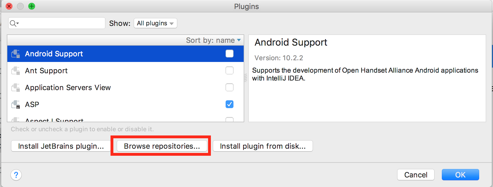
3. In the window that appears, enter “CS 61B” in the search bar at the top. The CS 61B plugin entry should appear.
4. Click the green **Install** button.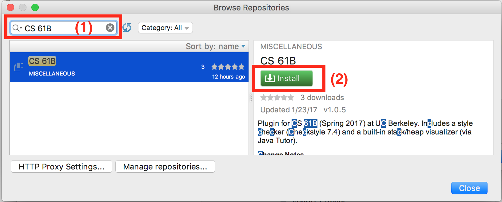
5. Wait for the plugin to download and install
6. Click the grey **Restart IntelliJ IDEA** button to finalize the installation.

For more information on using the plugin, read [the plugin guide](https://sp18.datastructur.es/materials/guides/plugin.html#using-the-plugin). You can skip this reading for now.

## Project Setup

IntelliJ is an IDE (Interactive Development Environment). It’s like a text editor (i.e. Sublime) but it’s full of extra features. In order to run your files in this special environment where we can work our IDE magic, we need to import our files into a project, similar to how you might import images or clips into a project for a program like iMovie or Windows Movie Maker. Fortunately, this is a fairly painless process.

These instructions apply for both initial setup and for future assignments. When you run `git pull skeleton master` to retrieve a new assignment and you notice that you have a new assignment directory (next week, you’ll have `lab3/`), simply run through these steps again from 1 to 8. This will likely involve pressing next for all steps and, if IntelliJ asks you to overwrite various housekeeping files (such as `.iml` files) because they already exist, respond “Yes” or “Overwite” to those popup windows. This is so IntelliJ can automatically mark the new directories for your assignment to work with IntelliJ for you as opposed to you manually marking directories as source folders and/or modules.

Begin the setup process by starting up IntelliJ. If you’re on one of the lab computers, use the command `/share/instsww/bin/idea.sh` in a terminal window to start IntelliJ. Then follow the steps below.

1. Upon opening IntelliJ, click on the “import project” option.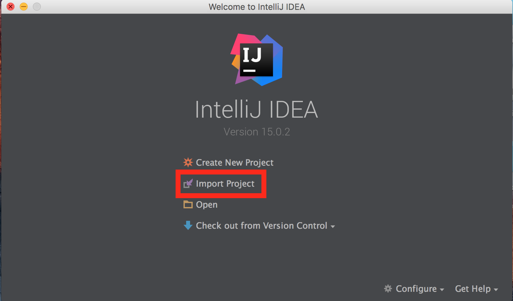

2. Find and choose your lab2setup directory, then press the OK button. From here on out, you should be able to simply select next for every screen but to be safe in the face of shenanigans, more screenshots follow. **If you keep clicking next without paying attention and get to a point where you see a message that says No SDK specified, stop and consult step 8!** If you’re on Mac OS or Ubuntu, you may get a different window corresponding to your operating system (the image below is from Windows).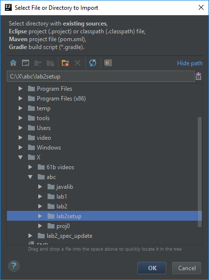

3. Make sure “Create project from existing sources” is selected and press next. You shouldn’t have to change anything at this step.

4. Leave these fields untouched and press next.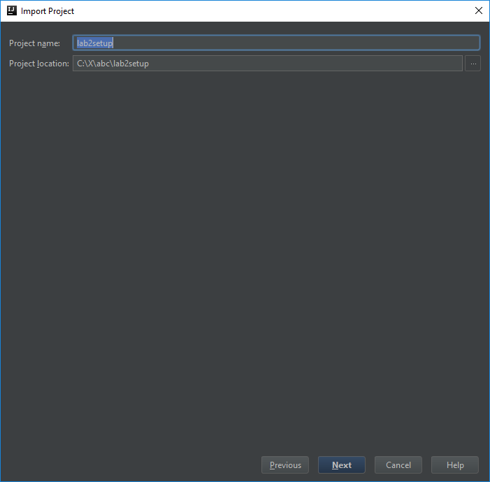

5. Do nothing here and press next. For context, IntelliJ is automagically detecting what your Java files are and self-configuring itself to edit and run them.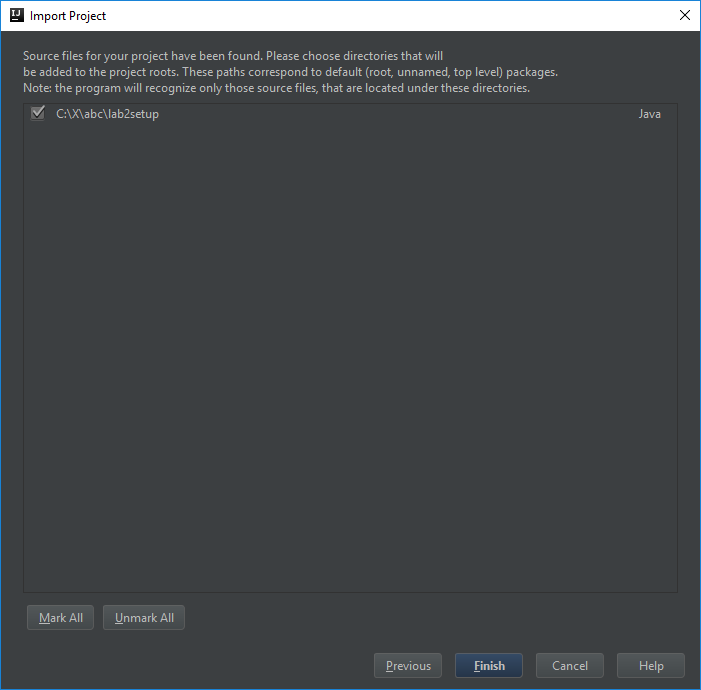

6. You may not actually see this next window pop up. If it does, click next. If it doesn’t, that’s fine.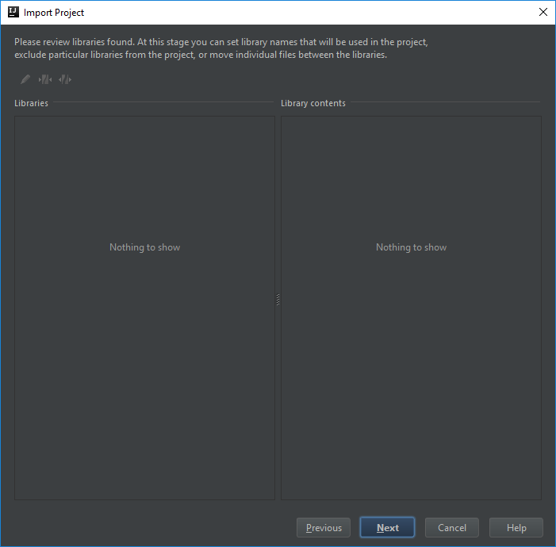

7. You may not actually see this next window pop up. If it does, click next. If it doesn’t, that’s fine.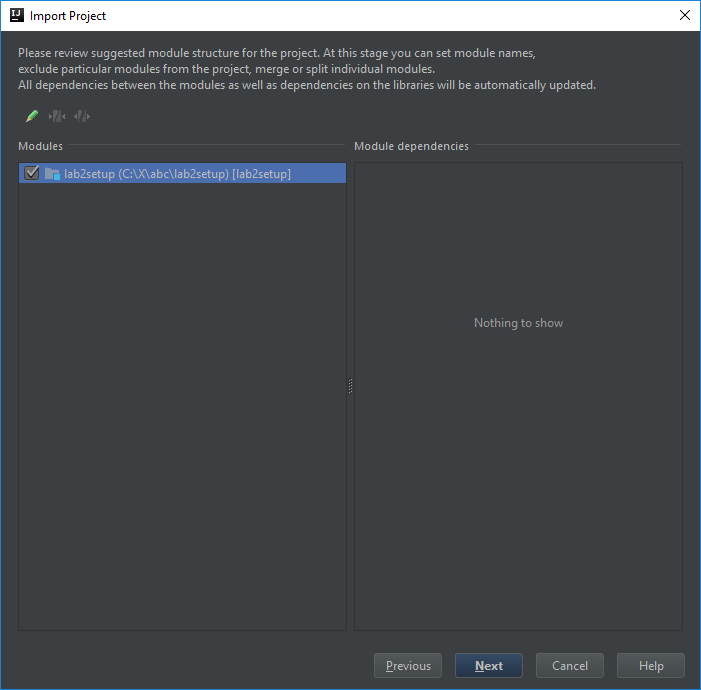

8. You may not actually see this next window pop up. If it does, and you see 9.0 on the left sidebar, you’re in the clear and can simply press next then click finish on the final screen and voila, your project is set up and you can skip steps 9 and 10! If you do NOT see 9.0 (or whatever version of Java you have installed), continue on to steps 9 and 10.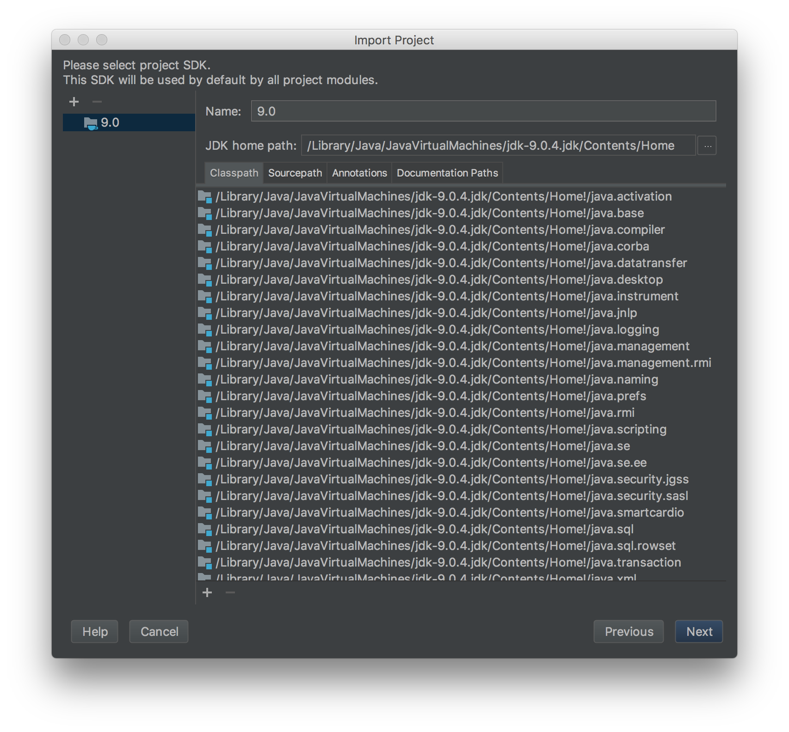

9. Click the plus in the upper left corner and click JDK from the drop-down menu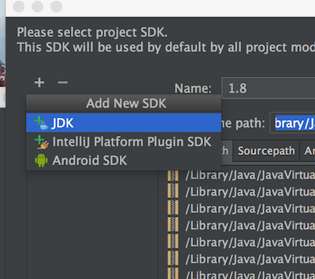

10. Find where your jdk is saved, select it, and press ok button. On my Mac, it was at `/Library/Java/JavaVirtualMachines/jdk-9.0.4.jdk/Contents/Home`. You can run `/usr/libexec/java_home` on your terminal to find out:

    ```
    $ /usr/libexec/java_home
    /Library/Java/JavaVirtualMachines/jdk-9.0.4.jdk/Contents/Home
    ```

    If you’re on Windows, your path may look like `C:\Program Files\Java\jdk9.0.4`. If you’re on a lab computer, it should be at `/usr/lib/jvm/java-9-oracle/`. Once this window closes and your screen looks like the image at step 8, press next, then finish, and you’re done!

Once you’ve pressed finish, you should see something really similar to the following image. You may need to click the little triangle next to `lab2setup` in the top left to get the source files (`Dog.java` and `DogTest.java`) for `lab2setup` to show up. If you don’t see the sidebar, go to **View -> Tool Windows -> Project**.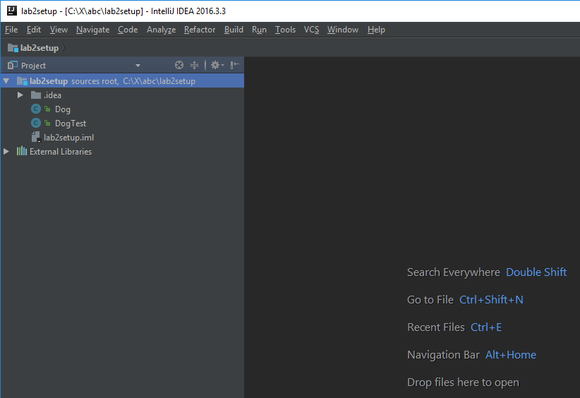

## Relax for a Bit

The first time you start up IntelliJ it’s going to spend some time indexing files. This may take a few minutes. There should be a little progress bar in the bottom right. Once it’s done, a sidebar will appear.

## Getting Java Libraries

Remember the empty `library-sp18` folder? We are going to populate that folder with the Java libraries we need for this class.

1. First, open up a terminal window and `cd` into your three-letter repository.

2. Run

    ```
    git submodule update --init
    ```

    You should get output like this:

    ```
    Submodule 'library-sp18' (https://github.com/Berkeley-CS61B/library-sp18.git)
    registered for path 'library-sp18'
    Cloning into '/Users/vivian/class/cs61b/viv/library-sp18'...
    Submodule path 'library-sp18': checked out
    '2bd75038edcf1ac7bacdb9e85fc08853153bd4e8'
    ```

3. Ta-da! You now have libraries!

    ```
    $ ls library-sp18/
    javalib/
    ```

    Below is shown the directory structure of `library-sp18`. Look inside the folder and make sure you see the six .jar files listed below. If you’re using your operating system’s file explorer the ‘jar’ part might not show up in the filenames, and that’s OK.

    ```
    library-sp18/
    └── javalib
     ├── algs4.jar
     ├── hamcrest-core-1.3.jar
     ├── jh61b.jar
     ├── junit-4.12.jar
     ├── stdlib-package.jar
     └── stdlib.jar
    ```

## Importing Libraries and Running Code

Double check on `DogTest.java`. You should see that some of the words in the file are red, specifically `Test` and `assertEquals`. If you mouse over them, you’ll see a message along the lines of “cannot resolve symbol”. The trouble is that we haven’t told IntelliJ where to find the CS61B libraries we just pulled.

Click **File -> Project Structure** in the top left of IntelliJ. A window should pop up, and you should click **Libraries** on the left panel of this window. When you’ve done so, it’ll look as shown below: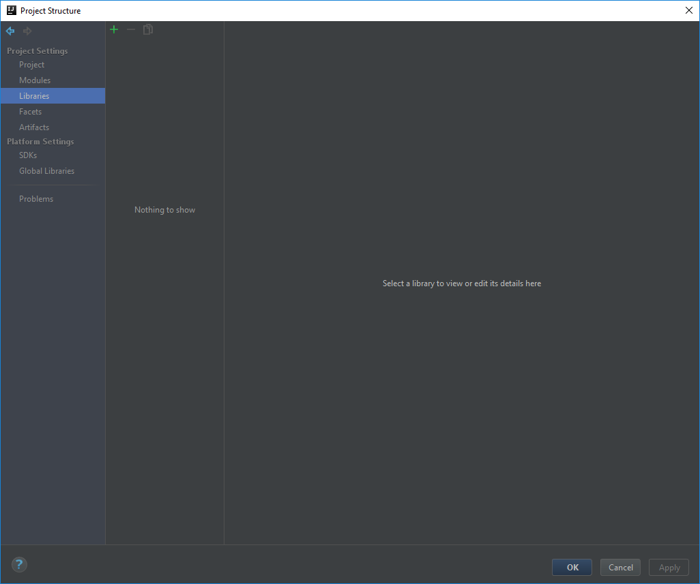

Click the green plus in the top left of this window and pick Java from among the given choices. This will pop up a window. Click on the `javalib` folder (which is in `library-sp18`) and press OK. If you get a message that says something like “IDEA cannot determine what kind of files the chosen items contain” then you probably selected the wrong folder. Make sure you’ve selected the “javalib” folder and not the “library-sp18” folder.

Press OK a few times, and you’ll find yourself looking at DogTest.java again. This time, the red text should be gone. If it is not, click **File -> Project Structure -> Problems -> Fix -> Add to Dependencies (first option) -> OK**.

Try running the code by clicking **Run -> Run**, as shown below.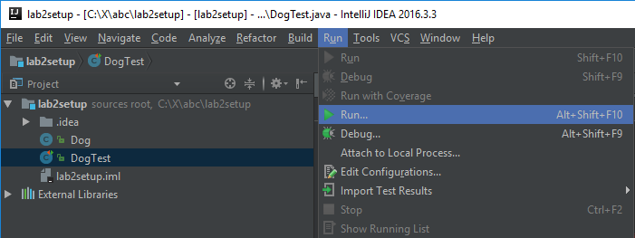

This will probably pop up a very small dialog window like the one shown. Basically IntelliJ is saying that it isn’t quite sure what you mean by running the program and is giving you two choices: 0. is to edit the configuration before running the program (which we won’t do). 2. is to run the DogTest class, which is what we want.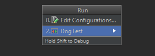

Click on DogTest and a green bar should appear with the message “All 2 tests passed.” as shown below.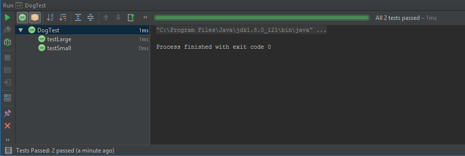

You’ll notice after running your code that the green play and green bug icons in the upper right are now green; this is because when you clicked “2.”, IntelliJ memorized what you meant by Run for this project and you can now click this button to run your program. You’ll learn more about this over time as we use more advanced features of IntelliJ.

## Josh’s IntelliJ Editor Settings

I’m not a big fan of the default IntelliJ colors, so I made my own color scheme, which is a very close imitation of the extremely good Sunburst theme for Sublime. To use my theme, download [hug_sunburst](https://sp18.datastructur.es/materials/lab/lab2setup/hug_sunburst.jar), and import it using the “File->Import Settings” option in IntelliJ. You might end up with large text, which I use for recording videos. To adjust the size of the font in Intellij to your liking, see [this link](https://www.jetbrains.com/help/idea/configuring-colors-and-fonts.html).

Update: If you import my color scheme, you’ll need to update your JDK path again, since importing my settings file seems to overwrite the JDK path you set up in steps 9 and 10 way up at the top.

## Embedded Terminal (Optional)

IntelliJ has the cool feature that you can have a working terminal in the workspace so you don’t have to constantly switch between having IntelliJ and your terminal, if that becomes necessary for whatever reason.

For Mac users, you should be able to skip this setup section. Windows users will likely have to put in a little leg work. This setup assumes you are a Windows user and you have git bash installed.

First, find the preferences/settings tab and select it (Or use Ctrl+alt+s)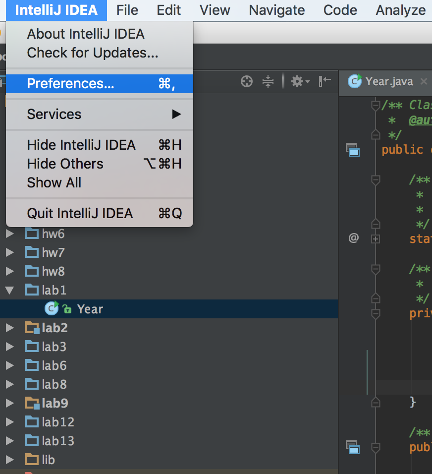

Type in “terminal” in the search bar. Once there, type in `"C:\Program Files (x86)\Git\bin\sh.exe" --login -i` into the Shell Path field. Click ok.

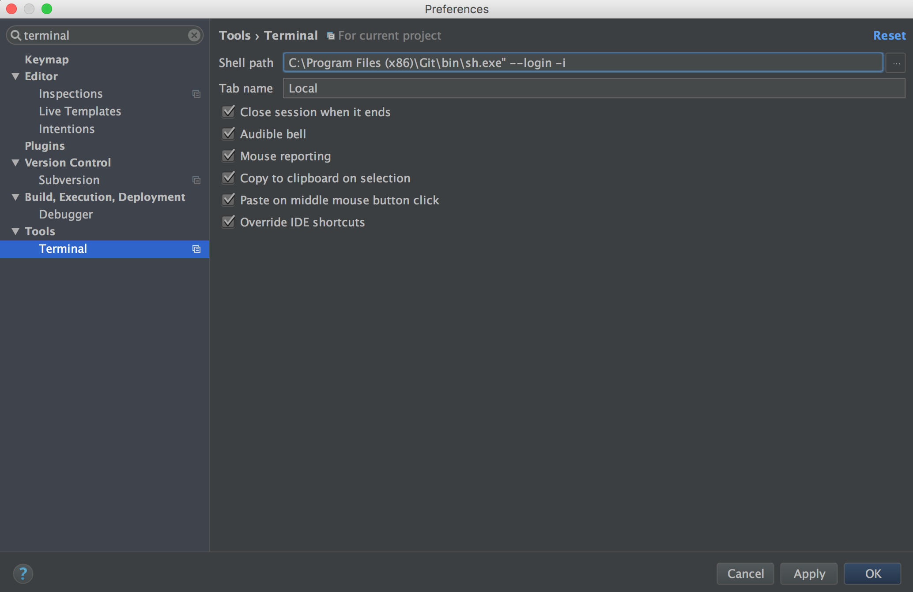

To test if you’ve properly set this up, hover over the little box in the bottom left corner and select terminal; the bottom third of your screen should now be a terminal, the equivalent of having git bash right there.

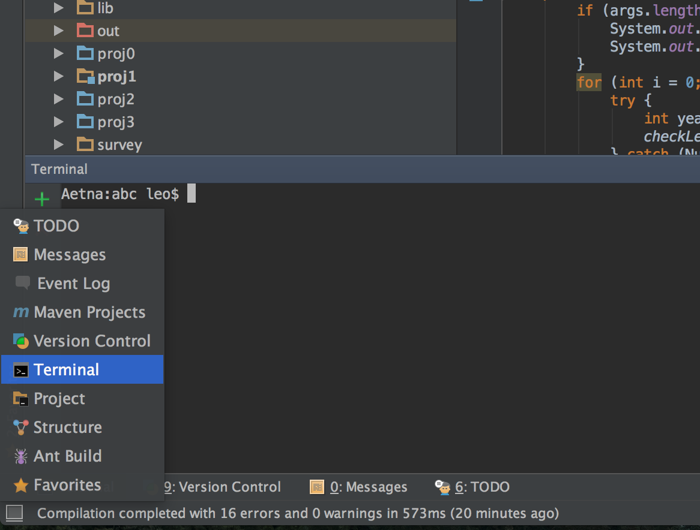

Try typing something in! If you’re able to run basic commands like “ls” or “cd” or “echo ‘Hello world’” you’ve done it!

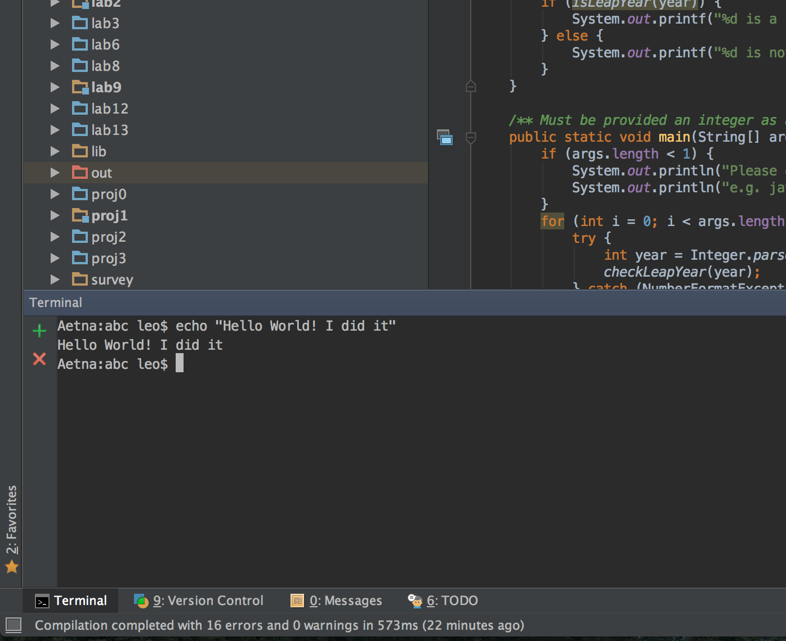